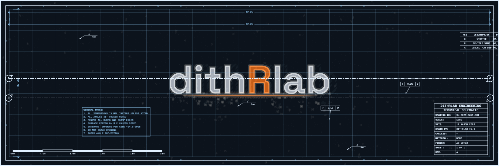
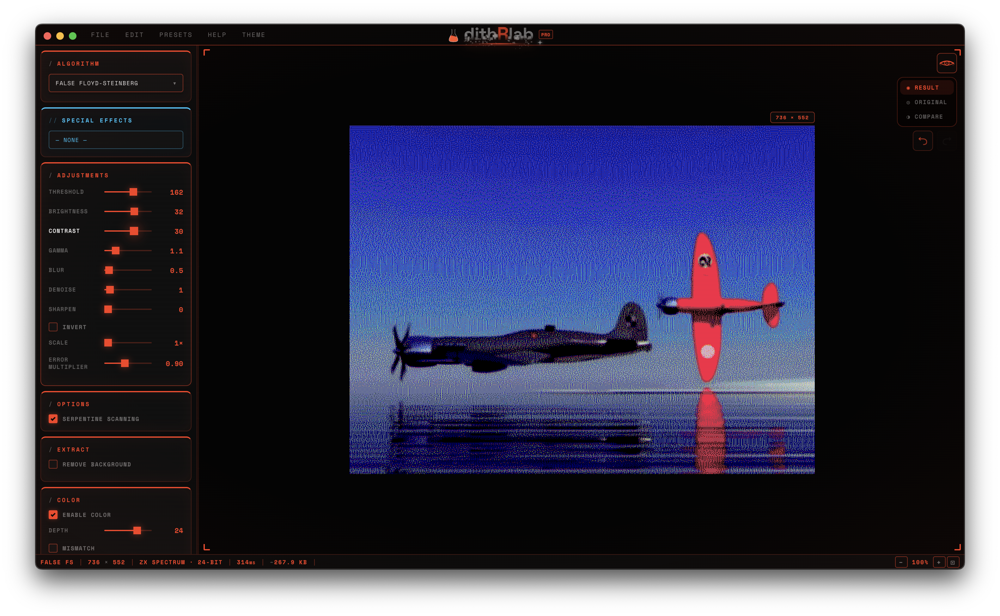
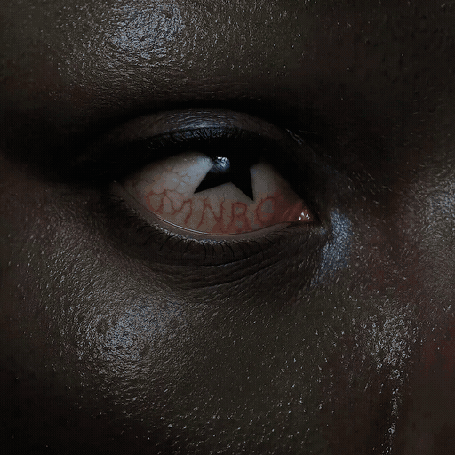
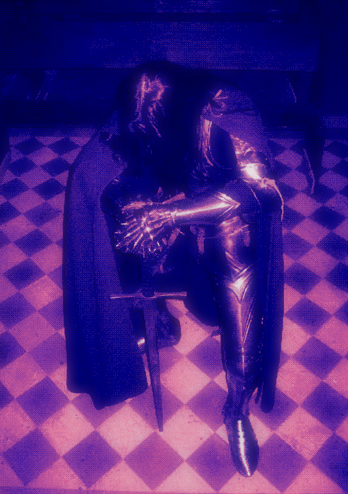
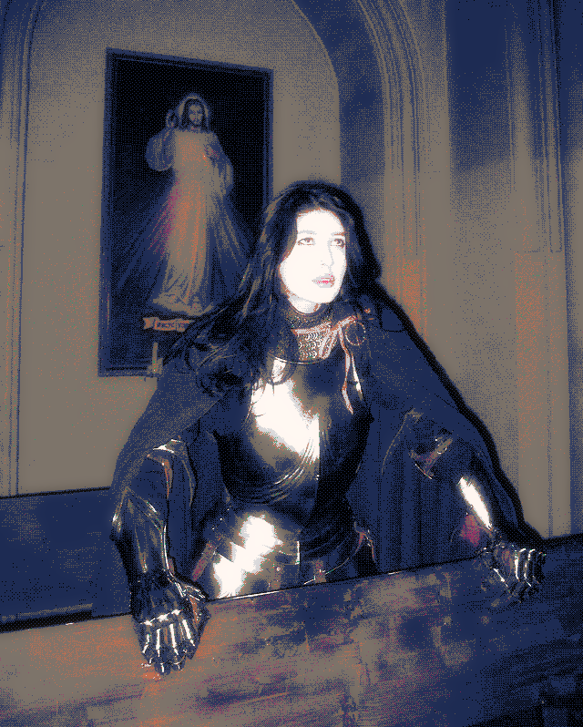
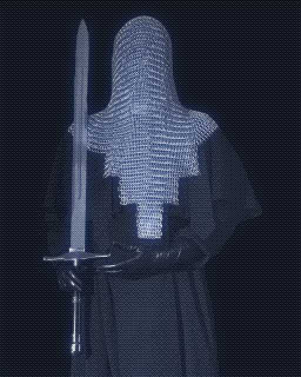
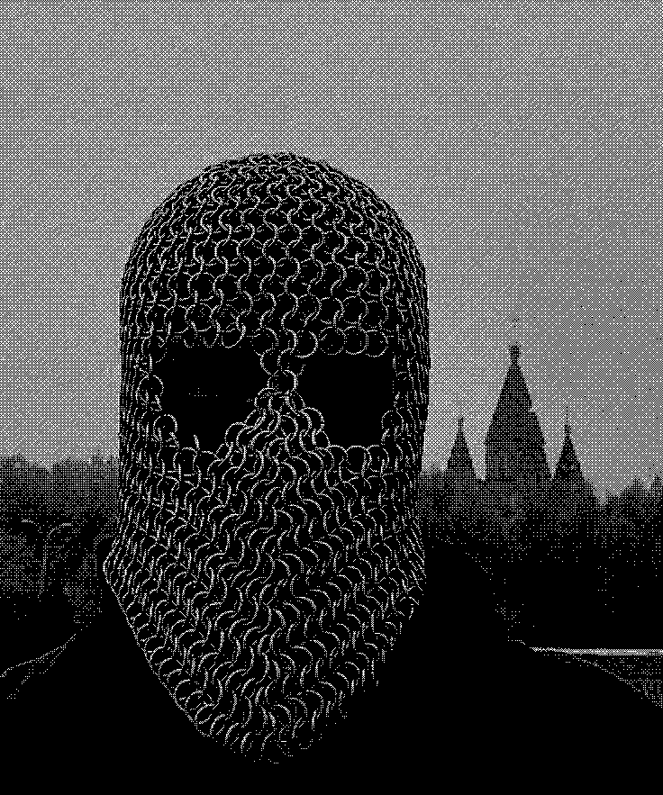

> **dithRlab - Weapons-grade creative dithering workstation.**

Turn any image into dithered art. Adjust everything in real time. Export to PNG, JPG, SVG, or video. No subscription. No account. Just pixels.

---

## Download

| Platform | Download |
|----------|----------|
| **macOS** (Apple Silicon) | [DITHRLAB-1.0.0-arm64.dmg](https://github.com/arcnought/dithrlab/releases/latest/download/DITHRLAB-1.0.0-arm64.dmg) |
| **Windows** | [DITHRLAB Setup 1.0.0.exe](https://github.com/arcnought/dithrlab/releases/latest/download/DITHRLAB.Setup.1.0.0.exe) |

Requires macOS 11+ or Windows 10+.

---

## What's Inside

### 80+ Dithering Algorithms

Nine categories of algorithms, each with adjustable sliders. Every change previews instantly. Processing runs in a background thread so the UI never freezes.

- **Error Diffusion** /18 algorithms including Floyd-Steinberg, Atkinson, Jarvis-Judice-Ninke, Stucki, Burkes, Sierra variants, and more
- **Ordered / Bitmap** /13 algorithms including Bayer matrices (2x2 through 16x16), clustered dot, dispersed dot, and diagonal ordered
- **Halftone** /4 styles: circle, line, diamond, and ellipse
- **Modulation** /15 algorithms including blue noise, FM screening, PWM, Riemersma, wave dither, spiral, and moiré
- **Pattern** /9 algorithms: crosshatch, lines (horizontal/vertical/diagonal), diamond, hex grid, brick, zigzag, triangle grid
- **Glitch** /8 algorithms: data corruption, pixel sort, displacement, scan line glitch, bit shift, channel shift, block glitch, VHS tracking
- **Waveform / CRT** /4 modes including RGB waveform glitch and CRT scanline
- **JPEG Glitch / Chromatic** /4 effects: JPEG glitch, chromatic aberration, scan line offset, artifact modulation

### 50+ Color Palettes

- **Basic** /Black & White, grayscale (4-shade, 8-shade)
- **Retro** /Game Boy, CGA, Commodore 64, NES, Apple II, ZX Spectrum, PICO-8, MSX, Teletext
- **Handheld** /GBA, Virtual Boy, Nokia 3310, Game Gear, WonderSwan, Atari Lynx
- **Contrasts** /Amber monitor, green phosphor, blue terminal, sepia, neon, vaporwave, cyberpunk, pastel, earth tones, and more
- **Seasonal** /Halloween, ghost, pumpkin, blood moon
- **Thermal** /FLIR Iron, rainbow, white/black hot, arctic, lava, medical
- **Custom** /build your own palette with a visual color editor

### Special Imaging Effects

Full-scene simulations that transform your image into something entirely different:

- **Thermal / FLIR** /heat-map visualization with multiple palettes, temperature readouts, crosshair targeting (free)
- **Night Vision** /phosphor green with noise, vignette, and HUD overlay (Pro)
- **Ultrasound** /medical imaging simulation with scan modes and artifacts (Pro)
- **Oscilloscope** /CRT phosphor display with 5 modes, 7 phosphor types, beam physics, graticule, and HUD (Pro)
- **Satellite** /orbital imagery with map overlays and coordinate grids (Pro)
- **Blueprint** /technical drawing style with grid lines and annotations (Pro)
- **Forensic Camera** /evidence documentation with 8 scene profiles, markers, date stamps, and body cam overlays (Pro)
- **Redacted Document** /classified document simulation with redaction bars, stamps, and paper aging (Pro)
- **Datamosh** /frame corruption and glitch effects (Pro)

*Special effect: Blueprint*

### Pre-Processing

Dial in the look *before* dithering: brightness, contrast, blur, sharpen, gamma, noise, denoise, invert. Small adjustments here produce dramatically different results.

### Post-Processing

- **Epsilon Glow** /CRT-style bloom on dithered dots
- **Star Effect** /4/6/8-point directional light spikes
- **Glow threshold + color tint** control

### Video Dithering

Dither entire videos frame-by-frame with real-time preview. Export to MP4 with audio preserved.

### Export & Workflow

- **PNG export** with transparency support
- **JPG and SVG vector export** (Pro)
- **Video export** /MP4 with preserved audio (Pro)
- **Batch processing** /dither entire folders at once (Pro)
- **Copy to clipboard** (Pro)
- **Compare view** /before/after split slider
- **Presets** /save, load, and share your settings
- **Undo/Redo** with 50-step history
- **7 UI themes** /Dark, CRT Green, Amber, Game Boy, Pink, Vaporwave, Light
- **Keyboard shortcuts** for everything

---

## Free vs Pro

DITHRLAB is free to download and use. Pro unlocks the full experience.

| | Free | Pro ($19) |
|---|:---:|:---:|
| Dithering algorithms | 15 core algorithms | 80+ across 9 categories |
| Color palettes | 10 + custom editor | 50+ across 7 categories + custom |
| Special imaging effects | Thermal / FLIR | All 9 effects |
| Pre-processing (brightness, contrast, etc.) | Yes | Yes |
| Post-processing (glow, star effect) | Yes | Yes |
| Real-time preview | Yes | Yes |
| Presets, undo/redo, compare view | Yes | Yes |
| 7 UI themes | Yes | Yes |
| PNG export | Yes | Yes |
| JPG export | - | Yes |
| SVG vector export | - | Yes |
| Video dithering + MP4 export | - | Yes |
| Batch processing | - | Yes |
| Copy to clipboard | - | Yes |
| Watermark | Small | None |
| All future updates | Yes | Yes |

**[Get Pro - $19 one-time](https://dithrlab.gumroad.com/l/pro)**
No subscription. All future updates included.

---

## Gallery

| | |
|---|---|
|  |  |
|  |  |

---

## Bug Reports

Found a bug? [Open an issue](https://github.com/arcnought/dithrlab/issues/new?template=bug_report.md).

---

## License

Proprietary. See [LICENSE](LICENSE) for details.

---

**Min-maxing.**
